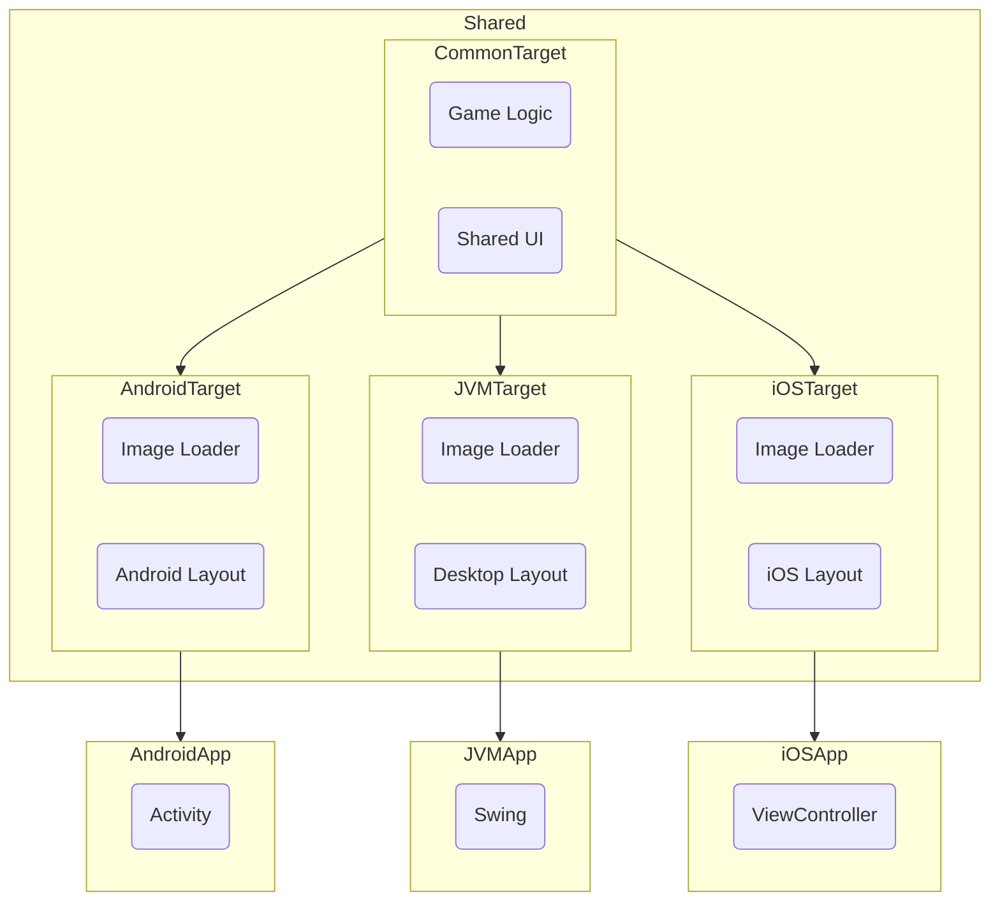

# Minesweeper in Compose Multiplatform

#### > You can find the source code in [Github](https://github.com/CRamsan/minesweepers).

Compose continues to expand to more platforms and with it, it is getting easier and easier to use. To show how versatile it is,
I decided to implement a simple project to showcase how Compose can work to implement a project in a multiplatform approach.
The project I decided to do was [Minesweeeper](https://en.wikipedia.org/wiki/Minesweeper_(video_game)), since it is a simple yet entertaining game known worldwide. 

| Android                                     | Desktop                                     | iOS                                     |
|---------------------------------------------|---------------------------------------------|-----------------------------------------|
|  |  |  |

## The Goal
- Implement Minesweeper
- Single-source-of-thruth for assets
- Game logic should be completely crossplatform
- UI code should use Compose to reuse as much code as possible
- Target Desktop(Linux/Mac/Windows), Android and iOS

## The Approach
The application is split into a gradle modules for each target with one shared module that holds the game logic and shared UI code.

You can see that all the game logic and most UI code is implemented in the common code. Then each platform's target 
provides two things, an Image Loader and a Compose layout. The Image Helper helps to provide a platform specific approach
to load the images from the local files. Each target also exposes the game through a layout written in Compose that adapts
to that specific platform screen.

Finally, there is module for each platform that bundles the game into their respective packages. 

## Implementation

The implementation is for the most part using the regular Compose APIs. Due to this I will not go into details about how this was implemented.
If you want to see more detils, you can take a look at the code for the [common code](https://github.com/CRamsan/minesweepers/tree/main/shared/src/commonMain/kotlin/com/cramsan/minesweepers/common/ui), 
the [android layout](https://github.com/CRamsan/minesweepers/blob/main/shared/src/androidMain/kotlin/com/cramsan/minesweepers/common/MainView.kt),
the [desktop layout](https://github.com/CRamsan/minesweepers/blob/main/shared/src/desktopMain/kotlin/com/cramsan/minesweepers/common/MainView.kt) 
and the [iOS layout](https://github.com/CRamsan/minesweepers/blob/main/shared/src/iosMain/kotlin/com/cramsan/minesweepers/common/GameViewController.kt).

## Final Words
For the most-part, the project achieved it's goal. The game is fully playable across all supported platforms. You can find the most up-to-date information in the [project's repo](https://github.com/CRamsan/minesweepers).
The performance on Android and Desktop seem to be stable, although on iOS I am noticing some hitching. I will look into profile this further to determine the root cause.

A big win was that all game logic and most of the UI code(expect for image loading) was done in shared code. There were no complexities or unexpected issues to address when 
due to the multiplatform nature of the project. 

An area where I encountered problems was with regards to loading the bitmaps to display. As of now, there is not a well supported and unified approach to load images asynchronously in
multiplatform code. Due to this I had to use `expect/actual` functions to provide three different implementations. In this case, this was not a blocker, but it does show that 
we are in the early stages of the Compose ecosystem.

